<h1 align="center">Hi 👋, I'm Rafael Campaña</h1>
<h3 align="center">A full stack developer and data scientist from Spain</h3>

  

<h3 align="center">Connect with me:</h3>

<h3 align="center">Languages and Tools:</h3>

  <table style="border-collapse: collapse; width: auto;">
    <tr>
      <td style="padding: 1.5em;"></td>
      <td style="padding: 1.5em;"></td>
      <td style="padding: 1.5em;"></td>
      <td style="padding: 1.5em;"></td>
      <td style="padding: 1.5em;"></td>
    </tr>
    <tr>
      <td style="padding: 1.5em;"></td>
      <td style="padding: 1.5em;"></td>
      <td style="padding: 1.5em;"></td>
      <td style="padding: 1.5em;"></td>
      <td style="padding: 1.5em;"></td>
    </tr>
    <tr>
      <td style="padding: 1.5em;"></td>
      <td style="padding: 1.5em;"></td>
      <td style="padding: 1.5em;"></td>
      <td style="padding: 1.5em;"></td>
      <td style="padding: 1.5em;"></td>
    </tr>
    <tr>
      <td style="padding: 1.5em;"></td>
      <td style="padding: 1.5em;"></td>
      <td style="padding: 1.5em;"></td>
      <td style="padding: 1.5em;"></td>
      <td style="padding: 1.5em;"></td>
    </tr>
    <tr>
      <td style="padding: 1.5em;"></td>
      <td style="padding: 1.5em;"></td>
      <td style="padding: 1.5em;"></td>
      <td style="padding: 1.5em;"></td>
      <td style="padding: 1.5em;"></td>
    </tr>
  </table>

 &nbsp;

        
